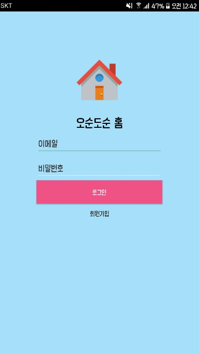
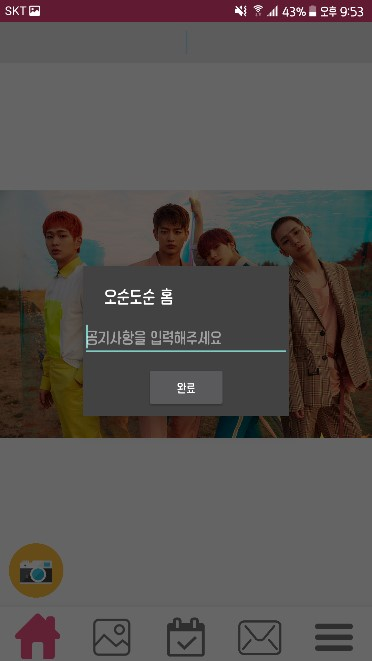
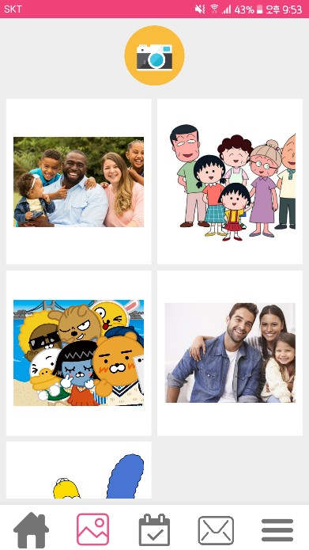
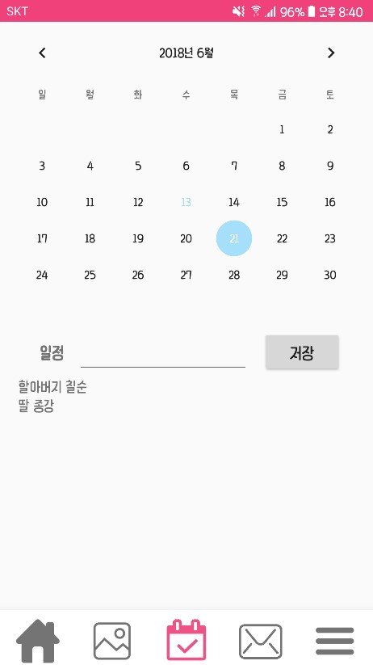
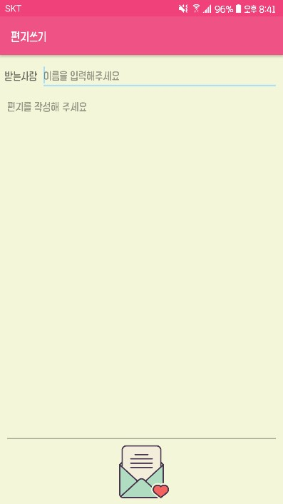
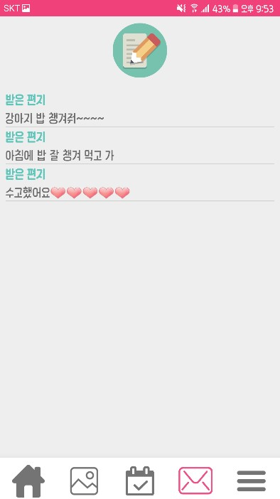

# 오순도순 홈
>오순도순 홈 2018-01 모바일앱프로그래밍 

###  주요 기능
1.시작화면
2.회원가입
3.메인화면(홈), 공지사항
4.앨범
5.일정
6.러브레터
7.내 정보

### 구성도
### 구동 화면

* 메인화면- 기본적인 앱의 메인화면, 기본 회원가입 및 로그인 구현

 

* 공지사항

* 앨범 - 앨범 공유 구현

* 일정 - 캘린더 및 일정 공유 구현

* 편지 작성

* 편지 함

### 개선해야 할 점
1. 편지함 오류 개선 - 2번씩 중복 저장
2. 가족코드를 이용하여 가족그룹 생성
3. 사진 삭제, 일정 수정·삭제
